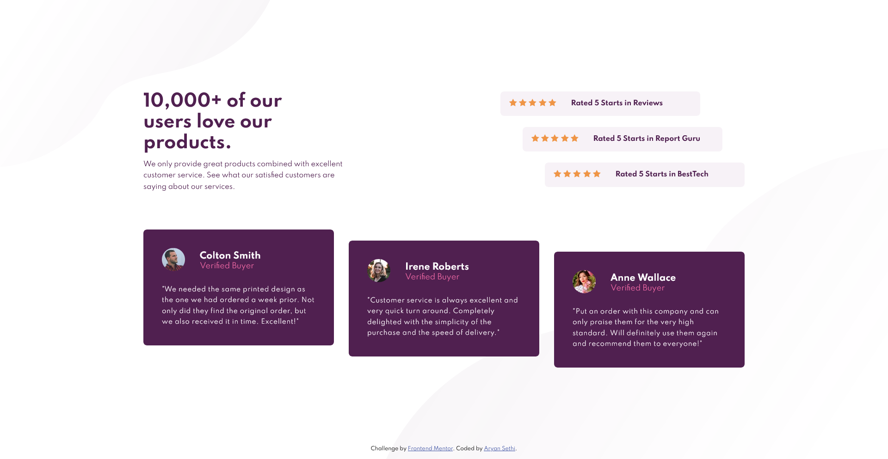
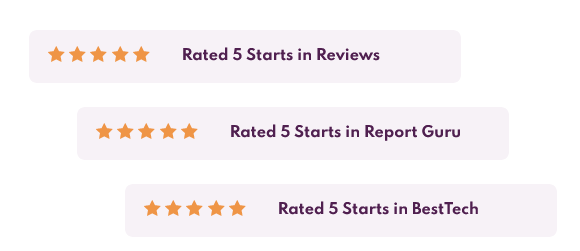
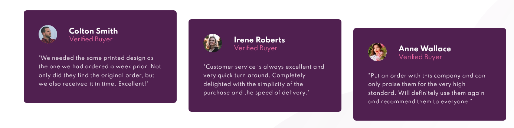

# Frontend Mentor - Social proof section solution

This is a solution to the [Social proof section challenge on Frontend Mentor](https://www.frontendmentor.io/challenges/social-proof-section-6e0qTv_bA). Frontend Mentor challenges help you improve your coding skills by building realistic projects. 

## Table of contents

- [Overview](#overview)
  - [The challenge](#the-challenge)
  - [Screenshot](#screenshot)
  - [Links](#links)
- [My process](#my-process)
  - [Built with](#built-with)
  - [What I learned](#what-i-learned)
  - [Continued development](#continued-development)
  - [Useful resources](#useful-resources)
- [Author](#author)

## Overview

### The challenge

Users should be able to:

- View the optimal layout for the section depending on their device's screen size

### Screenshot



### Links

- Solution URL: [Index.html File](./index.html)
- Live Site URL: [Responsive Social Proof section solution](https://aryan-ki-codepanti.github.io/social-proof-section-master/)

## My process

### Built with

- Semantic HTML5 markup
- CSS custom properties
- Flexbox
- CSS Grid

### What I learned

I learnt quite interesting things while making this project. I gained more clarity on whether to use flexbox or grid for some task
And also I learned about adding shift to elements of flexbox and grid 
It can be achieved with margins to opposite directions if container is bigger than elements (below) 

```css
.bar:nth-of-type(1) {
    margin-right: calc(2 * var(--Top-shift));
}
.bar:nth-of-type(2) {
    margin-right: var(--Top-shift);
}
```
Or another way to achieve if container height is same as element is to use both margins and negative margins in opposite direction so that all elements have same size

```css
.card:nth-of-type(2) {
    margin-top: var(--Down-shift);
    margin-bottom: calc(-1 * var(--Down-shift));
}

.card:nth-of-type(3) {
    margin-top: calc(2 * var(--Down-shift));
    margin-bottom: calc(-2 * var(--Down-shift));
}
```



### Useful resources

- [MDN dev docs](https://developer.mozilla.org/) - This helped me for tricks and tips and short lookups for CSS and Javascript.
- [Kevin Powell youtube channel](https://www.youtube.com/kepowob) - This helped me  understanding concepts of flexbox and grids in CSS.

## Author

- Frontend Mentor - [@Aryan-ki-codepanti](https://www.frontendmentor.io/profile/Aryan-ki-codepanti)
- Twitter - [@AryanSe73817078](https://www.twitter.com/AryanSe73817078)
- Youtube - [Channel: Coding Tiger](https://www.youtube.com/channel/UCkz7TnVuNBGEQOTa77lmZfA)